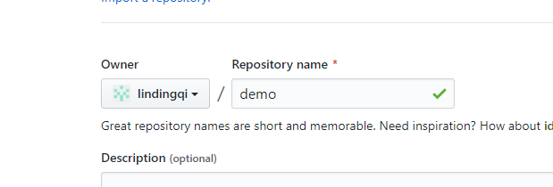
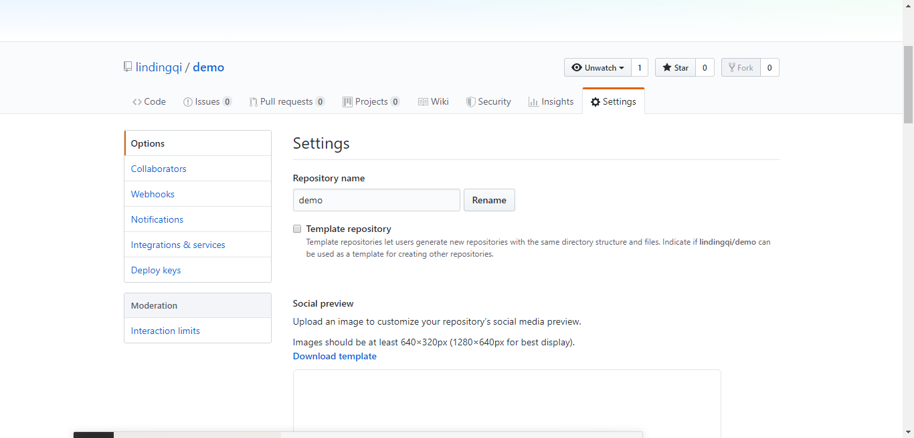

## 如果想在github上预览github仓库中的代码，可以通过使用github pages来实现这个功能。以下是我设置gitbub pages 的步骤，以备日后查询。
# 1.登入 GitHub，新建一个 repo。

1. 输入要创建的仓库名称，我这里的输入是demo
2. 初始化你的仓库并写入README文件
3. 点击绿色的按钮就创建了仓库

# 2.进入setting页面

1. 选中你刚才创建的仓库
2. 点击setting

# 3.setting页面向下滚，找到github pages进行设置

1. 选择master 分支。
2. 点击save，进行保存。

# 接下来得到这个仓库的预览地址。
